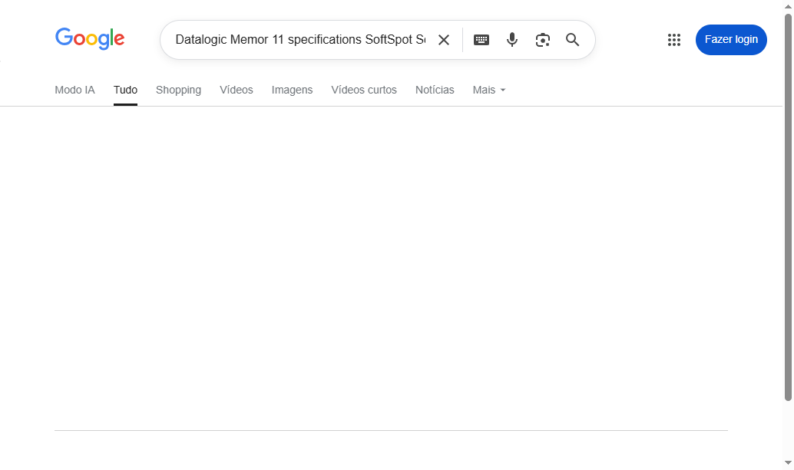
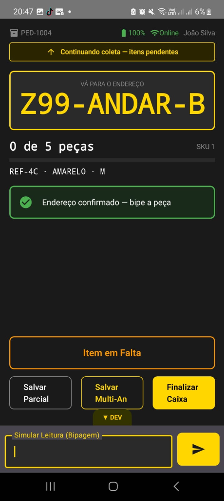

# KyliColetor (APS Coletor)

Projeto de um sistema completo (Aplicativo Android + Backend) focado em **bipagem intensiva de produtos para controle de inventário e logística em operações de grande volume**.

O sistema foi desenhado para funcionar de forma **offline-first**, garantindo a continuidade da operação mesmo sem conexão com a rede, sincronizando os dados posteriormente através de *background jobs*.

---

## 📸 Tour Visual

Abaixo você pode ver o funcionamento do aplicativo em produção rodando no coletor de dados (temas dinâmicos, validação de endereços, relatórios parciais e modo escuro otimizado para armazéns):

<div align="center">
  
  
</div>

<br/>
<p align="center">
  <i>Esquerda: Interface otimizada de Picking e Endereçamento | Direita: Resumo inteligente da caixa com contagem de divergências.</i>
</p>

---

## 🏗 Estrutura do Projeto

O repositório é um monorepo que contém as duas partes principais do projeto:

- `app/`: Aplicativo Android nativo
- `aps-coletor-backend/`: API Backend
- `docs/`: Documentações do projeto
- `skills/`: Diretrizes de desenvolvimento e automação utilizadas pela IA e pelo time

---

## 📱 Aplicativo Android (`/app`)

Aplicativo nativo focado em performance, robustez e usabilidade em dispositivos corporativos de coleta de dados (coletores com leitor de código de barras físico).

### Stack Tecnológico
- **Linguagem:** Kotlin
- **UI:** Jetpack Compose + Material 3
- **Arquitetura:** Clean Architecture + MVVM
- **Injeção de Dependência:** Hilt
- **Persistência Local (Offline-first):** Room Database
- **Tarefas em Segundo Plano (Sincronização):** WorkManager
- **Comunicação com API:** Retrofit + OkHttp
- **Testes:** JUnit, MockK, Turbine e Coroutines Test

### Principais Features
- Autenticação de múltiplos níveis (Operador e Supervisor em sessão conjunta)
- **Integração de Hardware (Intent API):** Escuta passiva de gatilhos físicos de coletores industriais (Datalogic, Zebra, etc.) sem uso de campo de texto no Compose
- **Fluxo de Separação Inteligente:** Validação prévia de endereço lógico vs endereço físico (Bipe de Gôndola)
- Registro de divergências com foto e UUID local ("Peça Amassada", "Item em Falta", etc.)
- **Resiliência Offline-First:** Filas de sincronização com *WorkManager*, *Network Health-checks* e Idempotência (tratamento limpo de erro 409 Conflict)

---

## ⚙️ Backend (`/aps-coletor-backend`)

API desenvolvida para gerenciar as rotas do coletor, autenticação de operadores e sincronização dos dados com o ERP.

### Stack Tecnológico
- **Framework:** NestJS (v11)
- **Linguagem:** TypeScript
- **Banco de Dados:** PostgreSQL com TypeORM
- **Autenticação:** JWT (Passport)
- **Segurança:** Helmet e Throttler (Rate Limiting)
- **Documentação:** Swagger (OpenAPI)
- **Testes:** Jest e Supertest (Unitários e E2E)

### Principais Features
- Autenticação e gestão de sessão de operadores (via matrícula)
- Sincronização de Ordens de Picking e divergências
- Endpoints otimizados para recebimento de dados de coletores em lote
- Rate limiting para proteção da API

---

## 🚀 Como Executar Localmente

### Pré-requisitos
- Android Studio (para o App)
- Node.js v18+ (para o Backend)
- PostgreSQL (ou Docker para subir o banco)

### Rodando o Backend

1. Navegue até a pasta do backend:
   ```bash
   cd aps-coletor-backend
   ```
2. Instale as dependências:
   ```bash
   npm install
   ```
3. Configure o banco de dados e as variáveis de ambiente (use o `.env.example` como base e crie um `.env`).
4. Rode as migrations/seeds se aplicável:
   ```bash
   npm run seed:all
   ```
5. Inicie o servidor:
   ```bash
   npm run start:dev
   ```
> A API estará rodando em `http://localhost:3000` (por padrão) e o Swagger em `http://localhost:3000/api`.

### Rodando o Aplicativo

1. Abra o projeto no Android Studio selecionando a pasta raiz ou a pasta `app/`.
2. Certifique-se de configurar a variável `API_BASE_URL` no `build.gradle.kts` ou em propriedades de compilação apontando para o seu IP local (ex: `http://192.168.0.X:3000/`).
3. Sincronize o projeto com o Gradle.
4. Execute o app em um emulador ou dispositivo físico.

---

## 🧪 Testes

### App
```bash
cd app
./gradlew test
```

### Backend
```bash
cd aps-coletor-backend
npm run test       # Testes Unitários
npm run test:e2e   # Testes E2E
```

## 📄 Licença
Uso restrito / Corporativo - Grupo Kyly
